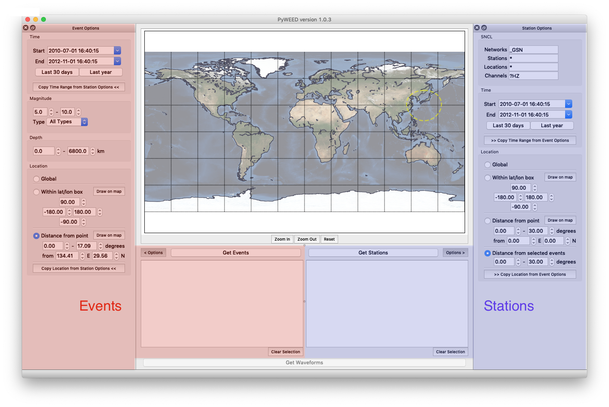
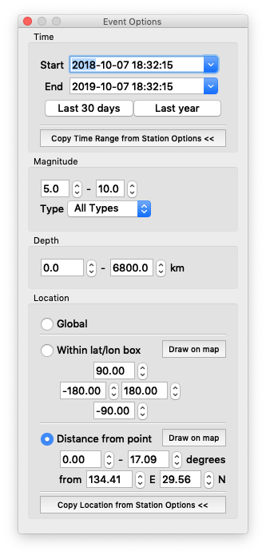
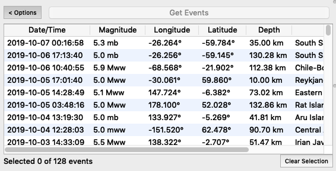
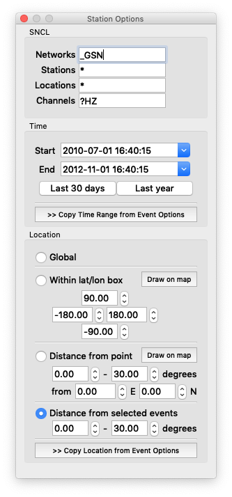
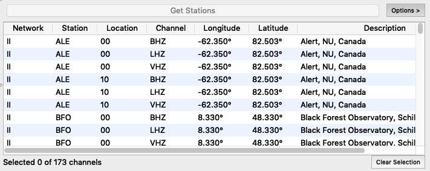
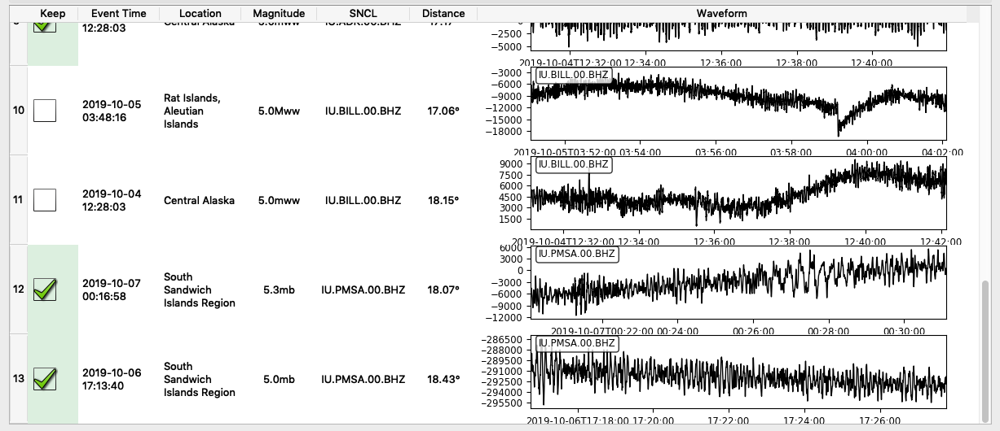

# User Guide

## Introduction

PyWEED is a tool for retrieving event-based seismic data.

Here, "event-based" data means that the selection of seismic stations, and the time window of the downloaded data, is based on the time and location of selected events. For example:

* data for every station between 10&deg; and 30&deg; distance from an event
* starting 1 minute before P-wave arrival at each station and ending 5 minutes after

## Main Window

The first step is to choose the events and seismic stations of interest.

The controls for selecting events are on the left of the window, and controls for selecting stations are on the right of the window. Both sets of controls operate in a similar fashion.

### Get Events

Query for events, and select the ones to include in the data request.

* Time
 * Use the calendar inputs to set explicit start/end dates
 * Shortcuts for quickly specifying recent events (last 30 days or last year)
* Magnitude
* Depth
* Location
 * Global (all events worldwide)
 * Within a bounding box
 * Based on distance from a geographic location

Once these are set, click the "Get Events" button to download events and list them in the table.

[More about query options](QueryOptions.md)

**Multiple rows** can be selected  
**Click** on a row to select it  
**Click again** on a row to deselect it  
**Click and drag** to select/deselect multiple rows
Use the **Clear selection** button to deselect all events

### Get Stations

The Station Options tab works much like the Event Options.

* SNCL
 * Set the Network / Station / Location / Channel to request
* Time
 * Use the calendar inputs to set explicit start/end dates
 * Shortcuts for quickly specifying recent events (last 30 days or last year)
* Location
 * Global (all events worldwide)
 * Within a bounding box
 * Based on distance from a geographic location
 * Based on distance from a selected event

Then click "Get Stations" and the available data channels will be listed.

[More about query options](QueryOptions.md)

**Note** that this actually lists each available *channel*, so there will often be multiple rows for each station.

Channel selection works the same way as event selection.

## Get Waveforms

Once events and channels are selected, click the "Get Waveforms" button to retrieve and examine the data. This will open up a new window.

### Choose the waveforms to save

By default, PyWEED will start with every waveform selected for inclusion in the output data. Selected waveforms are marked by a green checkmark. Clicking on a row toggles this.

Here, rows 10 and 11 have been deselected.

### Change the time window

PyWEED requests a "window" of data that, by default, is based on the projected P-wave arrival at a given station.

Start and end times can be set independently based on P-wave arrival, S-wave arrival, or the event time.

### Save data

Data can be saved in a variety of formats.

**Note** that currently PyWEED does not save response data (eg. SACPZ or StationXML).

